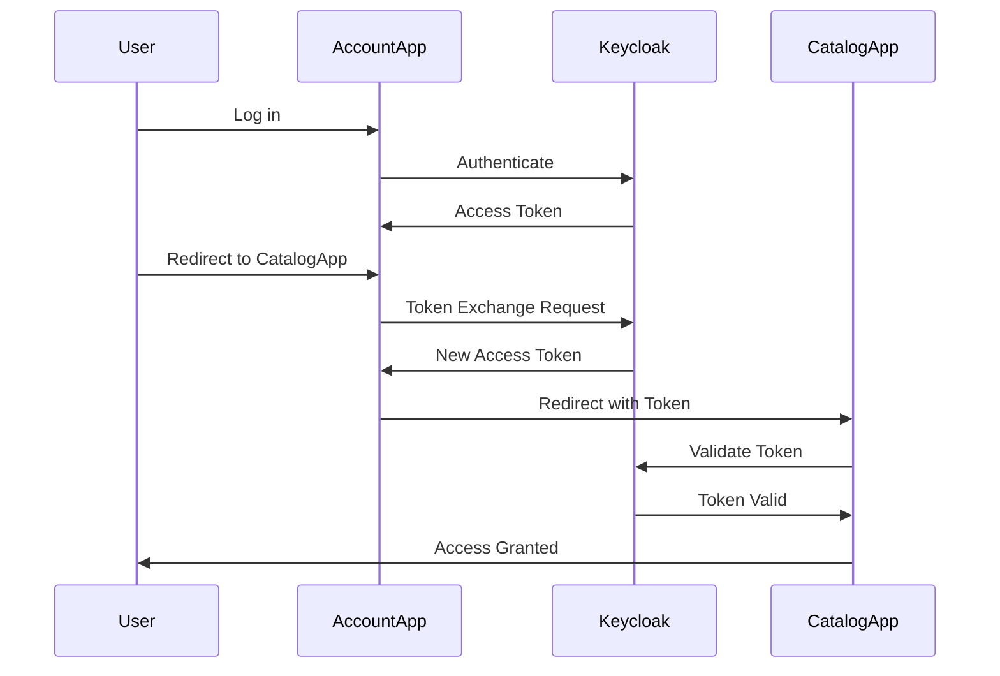

Welcome to **Architecture Nugget**, your go-to weekly newsletter for insights and updates in the world of software and system architecture.

Each week, we dive into the latest trends, best practices, and essential concepts that shape the architecture landscape. Whether you're navigating the transition from monolithic to microservices, exploring the intricacies of the SOLID principles, or mastering the art of system design, we've got you covered.

Join us as we explore real-world case studies, delve into design patterns, and uncover the secrets to building scalable, maintainable, and resilient systems. Let's embark on this journey together, one nugget at a time.

<!--more-->



### [Mastering the Monolith-to-Microservices Migration: A Comprehensive Guide for Production-Ready Java…](https://medium.com/@baruntiwari140/mastering-the-monolith-to-microservices-migration-a-comprehensive-guide-for-production-ready-java-f83cbeb0615d?source=rss------microservice-5)

This guide offers an in-depth look at transitioning from a monolithic to a microservices architecture, weighing the pros and cons of each. Monolithic systems are easier to deploy and debug but struggle with scaling and tight coupling. Microservices provide scalability, fault isolation, and technology diversity but add complexity in network communication and data consistency.

The guide presents a strategic migration plan, focusing on domain-driven design, service identification, and goal setting. It covers microservices best practices like loose coupling, single responsibility, and managing dependencies through event-driven architectures. Database strategies emphasize data decoupling and eventual consistency, while service communication is tackled through synchronous and asynchronous methods.

The guide also explores refactoring, API design, data migration, security, monitoring, and deployment strategies using Docker and Kubernetes. It underscores the importance of CI/CD pipelines, performance optimization, and resilience patterns like circuit breakers and bulkheads.

A real-world case study illustrates the migration process, challenges, and solutions, concluding with best practices for a successful transition to microservices.

[Read more...](https://medium.com/@baruntiwari140/mastering-the-monolith-to-microservices-migration-a-comprehensive-guide-for-production-ready-java-f83cbeb0615d?source=rss------microservice-5)

---

### [SOLID in detail: Single Responsibility Principle in C#](https://medium.com/@ljubomirbacovic/solid-in-detail-single-responsibility-principle-in-c-6ef06b43b42b?source=rss------clean_architecture-5)

The Single Responsibility Principle (SRP) is a fundamental concept in object-oriented design, asserting that a class should have only one reason to change, focusing on a single responsibility. Part of the SOLID principles by Robert C. Martin, SRP aids in creating simpler, more maintainable, and extensible code.

A class with multiple responsibilities can complicate maintenance and increase bug risks, as changes in one area might affect others. For instance, a `Report` class handling generating, saving, and emailing reports violates SRP due to multiple change reasons. To comply with SRP, responsibilities should be delegated to separate components or services, allowing the main class to coordinate tasks without direct handling.

This enhances code readability, maintainability, reusability, and testability. However, SRP should be applied judiciously, as unnecessary separation can lead to needless complexity if changes do not occur independently. Overall, SRP promotes modular and focused class design, contributing to robust and scalable software development.

[Read more...](https://medium.com/@ljubomirbacovic/solid-in-detail-single-responsibility-principle-in-c-6ef06b43b42b?source=rss------clean_architecture-5)

---

### [Must Know System Design Terms — Part #3](https://medium.com/@manoj.kumar.nanduri/must-know-system-design-terms-part-3-aabc2b546412?source=rss------distributed_systems-5)

In software architecture and system design, grasping key concepts is vital for building scalable and resilient systems. Here are five essential terms:

1. **Statelessness**: Designing systems where servers do not store client interaction states. Each client request contains all necessary information, enabling any server to handle any request independently. This is crucial for RESTful APIs and distributed systems, enhancing horizontal scalability and fault tolerance. However, managing state externally, such as through cookies or tokens, is necessary.

2. **Idempotence**: An operation is idempotent if performing it multiple times yields the same result as a single execution. This is crucial for consistency and reliability in distributed systems, especially where network issues may cause repeated requests. HTTP methods like GET, PUT, and DELETE are designed to be idempotent.

3. **Elasticity**: A system's ability to automatically adjust resources based on workload changes, optimizing cost and resource usage. Cloud platforms like AWS and Azure offer elastic services that scale resources according to demand, but careful tuning of auto-scaling rules is necessary to balance cost and performance.

4. **Multi-Tenancy**: A single software instance serves multiple tenants, each with isolated data and configurations. Common in SaaS applications, it optimizes resource usage but poses challenges like ensuring data security and performance isolation.

5. **CAP Theorem**: A distributed data store can only provide two of the following three guarantees: Consistency, Availability, and Partition Tolerance. Understanding these trade-offs is crucial for designing distributed systems, as you must prioritize based on your application's needs, such as response time versus data accuracy.

[Read more...](https://medium.com/@manoj.kumar.nanduri/must-know-system-design-terms-part-3-aabc2b546412?source=rss------distributed_systems-5)

---

### [Monolithic vs. Microservices: Impact on Technical Debt](https://mimrrhq.medium.com/monolithic-vs-microservices-impact-on-technical-debt-41ced75c9b66)

When choosing between monolithic and microservices architectures, consider the scale and needs of your application. Monolithic architecture is a traditional approach where the entire application is a single, unified unit. It's simpler to develop and deploy initially, making it ideal for small teams or startups aiming for quick market entry. However, it can lead to scalability issues, increased code complexity, and technical debt as the application grows, since changes require redeploying the entire system.

Microservices architecture, on the other hand, breaks down an application into smaller, independent services that communicate via APIs. This approach offers better scalability, fault isolation, and flexibility, allowing different teams to work on separate services concurrently. It reduces long-term technical debt by enabling incremental refactoring. However, it introduces complexity in managing multiple services, ensuring data consistency, and handling inter-service communication.

Microservices are generally more suited for large-scale applications that require rapid scaling and high availability.

[Read more...](https://mimrrhq.medium.com/monolithic-vs-microservices-impact-on-technical-debt-41ced75c9b66)

---

### [Understanding the CAP Theorem in Distributed Systems](https://medium.com/@sivakumar.skr/understanding-the-cap-theorem-in-distributed-systems-36229c94ebb5?source=rss------distributed_systems-5)

The CAP Theorem, introduced by Eric Brewer in 2000, is a fundamental concept in distributed systems that highlights the trade-offs between Consistency, Availability, and Partition Tolerance (CAP). In distributed systems, which consist of independent computers working together as a unified system, CAP Theorem states that only two of these three guarantees can be achieved simultaneously.

Consistency ensures all nodes reflect the same data at the same time, Availability guarantees system responsiveness, and Partition Tolerance allows the system to function despite network partitions. Partition Tolerance is essential due to inevitable network disruptions, leaving developers to choose between Consistency and Availability.

For example, MongoDB, a NoSQL database, typically prioritizes Availability and Partition Tolerance (AP) but offers tunable consistency settings to balance these aspects. Similarly, Apache Kafka, a distributed event streaming platform, leans towards AP but provides configurations for stronger consistency when needed.

The CAP Theorem remains relevant, guiding system architects in making informed trade-offs, although newer models like the PACELC Theorem further explore these trade-offs under normal conditions without network partitions. Ultimately, the CAP Theorem underscores the necessity for architects to prioritize based on application-specific requirements, as no distributed system can fully satisfy all three guarantees simultaneously.

[Read more...](https://medium.com/@sivakumar.skr/understanding-the-cap-theorem-in-distributed-systems-36229c94ebb5?source=rss------distributed_systems-5)

---

### [Book Review: “Stream Processing with Apache Flink” by Fabian Hueske & Vasiliki Kalavri](https://medium.com/devreads/book-review-stream-processing-with-apache-flink-by-fabian-hueske-vasiliki-kalavri-fb74626ba3bc?source=rss------software_architecture-5)

If you're diving into stream processing with Apache Flink, "Stream Processing with Apache Flink" by Fabian Hueske and Vasiliki Kalavri is a must-read. This book is a comprehensive guide for both beginners and seasoned engineers working with Flink. It covers everything from the fundamentals of stream processing, including the Lambda Architecture, to advanced topics like stateful operations and time-based processing.

Chapters 6 through 8 are particularly crucial for mastering Flink's capabilities, offering detailed explanations and Scala code examples for complex use cases. For those interested in the technical intricacies of Flink, Chapter 3 provides a deep dive into its architecture, including network optimizations and data transfer mechanisms.

The book also offers practical insights for deploying Flink at scale, with tips on checkpointing, recovery, and performance tuning in production environments. While the book's depth might be overwhelming for those seeking a high-level overview, it's an invaluable resource for anyone serious about leveraging Flink's full potential in real-time data processing.

[Read more...](https://medium.com/devreads/book-review-stream-processing-with-apache-flink-by-fabian-hueske-vasiliki-kalavri-fb74626ba3bc?source=rss------software_architecture-5)

---

### [Event-driven architecture on the modern stack of Java technologies](https://romankudryashov.com/blog/2024/07/event-driven-architecture/)

This article provides a comprehensive guide on implementing a microservices project using event-driven architecture patterns, specifically Transactional Outbox, Inbox, and Saga. The project utilizes a modern tech stack including Kotlin, Spring Boot 3, JDK 21, GraalVM, PostgreSQL, Kafka, Kafka Connect, Debezium, and Docker.

The architecture ensures reliable message delivery with exactly-once and ordering guarantees, while microservices communicate indirectly through their databases using Kafka Connect and Debezium connectors. The article details the setup of microservices, infrastructure components, and data streaming pipelines, emphasizing the importance of CloudEvents and Avro for standardized message formats. It also discusses the pros and cons of the architecture, highlighting its reliability and complexity.

The project demonstrates data replication between services and includes testing scenarios for REST API and user notifications. Additionally, the article addresses technical challenges encountered during implementation and contributions made to open-source projects like Debezium. The project is accessible online, showcasing the practical application of the discussed patterns and technologies.

[Read more...](https://romankudryashov.com/blog/2024/07/event-driven-architecture/)

---

### [Token Exchange in OAuth2: A Comprehensive Guide with a Real-World Use Case](https://medium.com/@boulamared.amine/token-exchange-in-oauth2-a-comprehensive-guide-with-a-real-world-use-case-5efd96509bd3?source=rss------microservice-5)

OAuth2 is a popular framework that allows applications to access user accounts securely. A key feature of OAuth2 is Token Exchange, which lets a client swap one token for another, useful in microservices where services need to act on behalf of users. Token Exchange is defined by RFC 8693 and supports delegation, impersonation, and token transformation.

The process involves obtaining an initial token, sending a token exchange request, validation by the authorization server, and issuance of a new token. Key parameters include `grant_type`, `subject_token`, and `requested_token_type`. A practical example involves two apps: Account App and Catalog App, using Keycloak for authorization. The Account App manages user authentication, while the Catalog App displays products. To allow seamless user transition between these apps without re-authentication, a token exchange flow is used. The Account App exchanges the user's token for one valid for the Catalog App, enabling smooth redirection.

Keycloak setup involves enabling token exchange, creating authorization scopes and policies, and assigning roles. Security considerations include protecting credentials, using HTTPS, and verifying tokens.

Here's a simplified flow:



This setup ensures secure and efficient user transitions between services using OAuth2 Token Exchange.

[Read more...](https://medium.com/@boulamared.amine/token-exchange-in-oauth2-a-comprehensive-guide-with-a-real-world-use-case-5efd96509bd3?source=rss------microservice-5)

---

### [Designing Scalable and Maintainable Microservices](https://medium.com/@divine_nnanna2/designing-scalable-and-maintainable-microservices-270df2139321?source=rss------api_design-5)

Microservices architecture breaks down complex applications into smaller, independently deployable services, each with a specific function, offering flexibility, scalability, and easier maintenance. Key principles include single responsibility, decentralization, and loose coupling, with services communicating via APIs and each having its own database.

Benefits include tailored scalability, faster maintenance, and tech flexibility. Best practices involve using an API gateway, service discovery, efficient data management, and containerization. Challenges include data consistency, network latency, and security, which can be addressed with tools like Kubernetes, Docker, and Prometheus.

Real-world examples like Netflix and Uber demonstrate successful microservices adoption. However, microservices add complexity and may not suit smaller projects without high scalability needs. Careful planning and adherence to design principles are crucial for leveraging microservices effectively.

[Read more...](https://medium.com/@divine_nnanna2/designing-scalable-and-maintainable-microservices-270df2139321?source=rss------api_design-5)

---

### [Registry Design Pattern](https://anubhav-gupta62.medium.com/registry-design-pattern-ad4b4c3350e6?source=rss------design_patterns-5)

The Registry Design Pattern is a creational pattern used to store and retrieve objects globally within an application. It acts like a centralized database, allowing different parts of the application to access shared instances without explicitly passing them around. This pattern provides global access to resources, ensures singleton-like behavior by maintaining single instances, and uses a lookup mechanism with keys to retrieve objects.

It's useful when shared objects need to be accessed by various parts of an application, avoiding the need for dependency injection. However, it can lead to issues like hidden dependencies and testing difficulties due to its global state nature.

In a plugin management system, the Registry Design Pattern can efficiently manage plugins by acting as a central store. Each plugin registers itself with the registry, allowing the application to discover and use them dynamically. This setup supports a flexible architecture where new plugins can be added without altering the core application.

The provided code demonstrates a simple implementation where plugins like email notifications, data export, and database connections are registered and executed through a `PluginRegistry` class.

```java
public interface Plugin {
    void execute();
}

public class PluginRegistry {
    private static volatile PluginRegistry instance;
    private Map<String, Plugin> registry = new ConcurrentHashMap<>();

    private PluginRegistry() { }

    public static PluginRegistry getInstance() {
        if (instance == null) {
            synchronized (PluginRegistry.class) {
                if (instance == null) {
                    instance = new PluginRegistry();
                }
            }
        }
        return instance;
    }

    public void registerPlugin(String key, Plugin plugin) {
        registry.put(key, plugin);
    }

    public Plugin getPlugin(String key) {
        return registry.get(key);
    }
}

public class Client {
    public static void main(String[] args) {
        PluginRegistry registry = PluginRegistry.getInstance();
        registry.registerPlugin("emailNotification", new EmailNotificationPlugin());
        registry.registerPlugin("dataExport", new DataExportPlugin());
        registry.registerPlugin("dbConnection", new DatabaseConnectionPlugin());

        Plugin emailPlugin = registry.getPlugin("emailNotification");
        emailPlugin.execute();

        Plugin dataExportPlugin = registry.getPlugin("dataExport");
        dataExportPlugin.execute();

        Plugin dbConnectionPlugin = registry.getPlugin("dbConnection");
        dbConnectionPlugin.execute();
    }
}
```

This code demonstrates how plugins are registered and executed using the registry pattern.

[Read more...](https://anubhav-gupta62.medium.com/registry-design-pattern-ad4b4c3350e6?source=rss------design_patterns-5)

---

### [Mastering Microservices: Ensuring Data Consistency with the Outbox Pattern](https://thedevsaddam.github.io/posts/mastering-microservics-ensuring-data-consistency-with-the-outbox-pattern/)

In an e-commerce application, when a customer places an order, ensuring reliable communication between services is crucial. The Outbox Pattern is a design strategy that addresses the challenges of maintaining data consistency and reliable message delivery in distributed systems, particularly in microservices architectures.

Instead of directly sending events to an event bus or message broker, which can lead to issues if the bus is unavailable, the Outbox Pattern involves writing both the business data and the event message to an outbox table within the same database transaction. This ensures atomicity, meaning either both actions succeed or neither does, thus maintaining consistency.

A separate process, often a background worker, reads from the outbox table and sends the messages to the appropriate message broker. This decouples the order creation from the event publishing, reducing temporal coupling and improving system reliability. The pattern also requires implementing idempotency in the receiving services to handle potential duplicate messages gracefully.

While the Outbox Pattern adds some complexity, such as managing the outbox processing and handling database load, it provides significant advantages in reliability, atomicity, and failure recovery, making it a valuable approach in event-driven architectures and microservices communication.

[Read more...](https://thedevsaddam.github.io/posts/mastering-microservics-ensuring-data-consistency-with-the-outbox-pattern/)

---

### [Visitor Design Pattern](https://anubhav-gupta62.medium.com/visitor-design-pattern-a71a30289a68?source=rss------design_patterns-5)

The Visitor Design Pattern is a behavioral design pattern that allows you to add new operations to objects without altering their structure. It separates algorithms from the objects they operate on, making it easier to manage and extend functionality.

The pattern involves several key components: a Visitor Interface that declares visit methods for each element type, Concrete Visitors that implement these methods, an Element Interface with an accept method, and Concrete Elements that implement the accept method to allow visitors to process them.

This pattern is useful when you need to perform multiple operations on objects of different types without modifying their classes, adhering to the Single Responsibility and Open/Closed principles. However, it can introduce complexity and inefficiency due to double dispatch.

For example, in a tax calculation system for different employee types (Full-time, Contract, Intern), the Visitor pattern allows you to calculate taxes or generate reports without changing the employee classes. You can create a TaxVisitor to handle tax calculations and a PerformanceReportVisitor for generating performance reports.

This approach is also used in real-world scenarios like compilers, UI frameworks, and document editors, where operations need to be applied to various components or document parts. The Visitor pattern is ideal for systems with complex object structures that require flexible and extendable operations.

[Read more...](https://anubhav-gupta62.medium.com/visitor-design-pattern-a71a30289a68?source=rss------design_patterns-5)