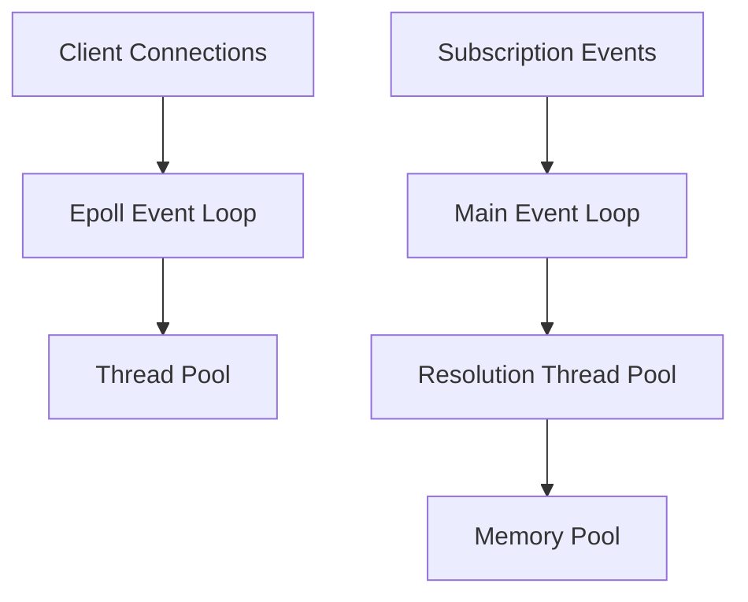
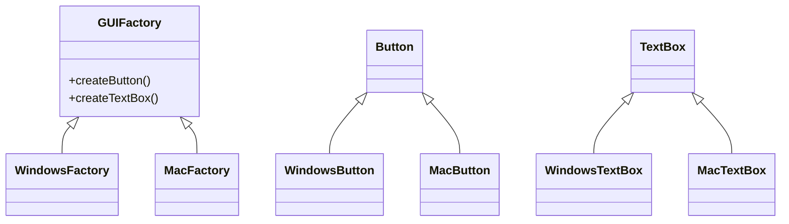
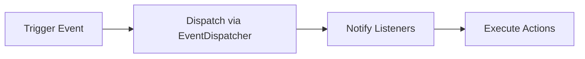

Welcome to **Architecture Nugget**, your go-to source for insights and updates in the world of software and system architecture.

This week, we dive into the art of scaling GraphQL subscriptions using an event-driven approach in Go, explore the Liskov Substitution Principle for cleaner mobile architecture, and discuss when microservices might not be the best choice for your project.

We also clear up common misconceptions about Event-Driven Architecture, showcase the Abstract Factory Design Pattern for UI consistency, and guide you through event-driven programming in Symfony.

Plus, learn how to safely use Kafka production data in your testing environment to enhance test accuracy.

Join us as we unravel these topics and more, offering practical tips and real-world examples to help you navigate the ever-evolving landscape of software architecture.
<!--more-->



### [Scaling GraphQL Subscriptions in Go with Epoll and Event Driven Architecture](https://wundergraph.com/blog/edfs_scaling_graphql_subscriptions_in_go)

The challenge was optimizing GraphQL Subscriptions in a federated architecture that was creating too many goroutines and consuming excessive memory. The initial implementation used 4 goroutines per client connection and consumed nearly 2GB of heap memory for 10,000 connections.

The solution involved two major architectural shifts:

1. **Connection Management:**
  - Replaced blocking WebSocket reads with an event-driven Epoll/Kqueue system
  - Single goroutine handles multiple connections by waiting for OS events
  - Thread pool processes incoming messages to prevent blocking the event loop

2. **Subscription Processing:**
  - Moved from blocking channel reads to an event-driven architecture
  - Single main loop processes all subscription events (subscribe/unsubscribe/updates)
  - Shared trigger system with unique IDs to prevent duplicate subscriptions
  - Thread pool handles update resolution with memory pooling

Key architectural patterns:


The new architecture eliminated synchronization complexity by processing related operations in single goroutines. Thread pools with controlled concurrency replaced unlimited goroutine creation. Memory pooling and short-lived allocations reduced heap usage.

Results:
- Reduced goroutines by 99% (from 40,000 to 42)
- Decreased memory usage by 90% (from 2GB to 200MB)
- Maintained performance while improving resource efficiency
- Simplified maintenance through centralized event handling

This event-driven approach demonstrates how architectural changes can dramatically improve system efficiency without sacrificing functionality.

[Read more...](https://wundergraph.com/blog/edfs_scaling_graphql_subscriptions_in_go)

---

### [Liskov Substitution Principle — Clean Mobile Architecture by Petros Efthymiou](https://medium.com/@alyaatalaat205/liskov-substitution-principle-clean-mobile-architecture-by-petros-efthymiou-b6c5b683f4dc?source=rss------clean_architecture-5)

The Liskov Substitution Principle (LSP) ensures derived classes can seamlessly replace their base types without breaking functionality. Here's how to implement it effectively:

```typescript
// Base interface defining the contract
interface Notification {
    send(message: string): void;
    getDeliveryStatus(): boolean;
}

// Implementations that respect LSP
class EmailNotification implements Notification {
    send(message: string): void {
        // Email-specific implementation
    }
    getDeliveryStatus(): boolean {
        return true; // Implementation matches base contract
    }
}

class PushNotification implements Notification {
    send(message: string): void {
        // Push-specific implementation
    }
    getDeliveryStatus(): boolean {
        return true; // Implementation matches base contract
    }
}
```

Key benefits:
- Predictable behavior across different implementations
- Easy addition of new types without modifying existing code
- Better testability through consistent interfaces
- Reduced bugs from incompatible implementations

The accompanying image illustrates LSP through a visual metaphor of interchangeable blocks, where blue blocks (derived classes) can seamlessly replace white ones (base classes) while maintaining system integrity.

💡 Pro tip: When designing class hierarchies, always ask: "Can I use any subclass instance anywhere the parent class is expected, without surprising behavior?"

Want to explore more? Try implementing a notification system with different delivery methods while ensuring LSP compliance.

[Read more...](https://medium.com/@alyaatalaat205/liskov-substitution-principle-clean-mobile-architecture-by-petros-efthymiou-b6c5b683f4dc?source=rss------clean_architecture-5)

---

### [Why You Should NOT Use Microservices?](https://medium.com/@hakanapohan/why-you-should-not-use-microservices-7b202cf9c44c?source=rss------microservice-5)

Neither microservices nor monoliths are a silver bullet - the best architecture depends entirely on your context. Here's what really matters:

**Microservices Excel When You Need:**
- Independent scaling of components
- Rapid deployment cycles
- Technology diversity across services
- Strong fault isolation
- Large teams working autonomously

**Monoliths Shine When You Have:**
- Smaller teams and simpler applications
- Need for quick time-to-market
- Limited infrastructure budget
- Strong data consistency requirements
- Straightforward deployment needs

**Key Decision Factors:**
- Application complexity
- Team size and expertise
- Budget constraints
- Scalability requirements
- Time-to-market pressure
- Data consistency needs

Real-world examples prove both approaches can work: Netflix thrives with microservices, while Shopify scales successfully with a monolith. The key is matching architecture to your specific needs rather than following trends.

Consider starting with a well-structured monolith and evolving to microservices only when complexity and scale truly demand it. This approach minimizes initial complexity while keeping options open for future growth.

Want to make the right choice? Start by honestly assessing your team's capabilities, business requirements, and operational constraints rather than jumping on the latest architectural trend.

[Read more...](https://medium.com/@hakanapohan/why-you-should-not-use-microservices-7b202cf9c44c?source=rss------microservice-5)

---

### [Five Common Misconceptions About Event-Driven Architecture](https://www.reactivesystems.eu/2024/09/30/five-common-misconceptions-about-eda.html)

Let's clear up some key misconceptions about Event-Driven Architecture (EDA) and explore what it actually entails.

Event-Driven Architecture is fundamentally about inter-service communication patterns, not data persistence. While it pairs well with Event Sourcing, they serve different purposes. Event Sourcing handles state management within services, while EDA manages communication between them.

The architecture allows services to:
- Publish domain changes as events
- Subscribe to events from other services
- Act independently without direct coupling

Key architectural patterns:
```yaml
Communication Patterns:
- Event Publishing: Services broadcast state changes
- Event Subscription: Services listen for relevant events
- Asynchronous Processing: No immediate response required
```

Implementation flexibility:
- Message Brokers: Kafka or similar log-based systems
- Alternative Options: Message queues, HTTP feeds
- Hybrid Approaches: Event-driven core with REST/RPC edges

A common anti-pattern shows up when events are misused as commands:

This creates hidden coupling through "passive-aggressive commands" - events that expect specific responses.

Best practices:
- True events describe completed facts
- Publishers shouldn't care about subscribers
- Events should be broadcast, not targeted
- External interfaces can use different patterns
- Backend services can be fully event-driven while frontends use REST

The architecture isn't inherently complex - it's just different from traditional request-response patterns. When implemented correctly, it offers cleaner separation of concerns and better service autonomy than REST/RPC alternatives.

[Read more...](https://www.reactivesystems.eu/2024/09/30/five-common-misconceptions-about-eda.html)

---

### [Liskov Substitution Principle with C# Examples](https://medium.com/@ljubomirbacovic/liskov-substitution-principle-with-c-examples-a521aafcf2ce?source=rss------software_architecture-5)

The Liskov Substitution Principle (LSP) ensures subclasses can fully replace their parent classes without breaking functionality. Here's how to implement it effectively:

Key points:
- Subclasses must honor the base class contract without strengthening preconditions or weakening postconditions
- Use generics with constraints for type-safe collections instead of runtime type checking
- Design by contract to maintain consistent behavior across the inheritance hierarchy

Example of LSP violation vs correct implementation:

```csharp
// ❌ LSP Violation
public class CircleCollection : ShapeCollection {
    public override void AddShape(Shape shape) {
        if (shape is Circle) // Runtime type checking breaks substitution
            shapes.Add(shape);
        else
            throw new InvalidOperationException();
    }
}

// ✅ LSP Compliant using generics
public class ShapeCollection<T> where T : Shape {
    protected List<T> shapes = new List<T>();
    public virtual void AddShape(T shape) {
        shapes.Add(shape);
    }
}
```

Benefits:
- Improved maintainability through predictable inheritance behavior
- Better extensibility via proper polymorphism
- Reduced bugs from unexpected subclass behavior
- More reliable plugin/component architectures

Remember: If you're checking types at runtime or throwing exceptions for "invalid" subtypes, you're probably violating LSP. Design your hierarchies thoughtfully from the start.

Want to dive deeper? Explore how LSP applies to your current inheritance hierarchies and identify potential violations.

[Read more...](https://medium.com/@ljubomirbacovic/liskov-substitution-principle-with-c-examples-a521aafcf2ce?source=rss------software_architecture-5)

---

### [Abstract Factory Design Pattern](https://anubhav-gupta62.medium.com/abstract-factory-design-pattern-67116af1fc7f?source=rss------design_patterns-5)

The Abstract Factory pattern elegantly solves UI consistency across different platforms by creating families of related components without coupling to specific implementations.

Key points:
- Creates related objects through a common interface
- Ensures platform-specific components work together seamlessly
- Promotes loose coupling between client code and concrete implementations

Here's a practical example using GUI components:

```java
// Define abstract factory interface
interface GUIFactory {
    Button createButton();
    TextBox createTextBox();
}

// Concrete factory for Windows
class WindowsFactory implements GUIFactory {
    public Button createButton() { return new WindowsButton(); }
    public TextBox createTextBox() { return new WindowsTextBox(); }
}

// Client code remains platform-agnostic
class Application {
    private Button button;
    private TextBox textBox;
    
    public Application(GUIFactory factory) {
        button = factory.createButton();
        textBox = factory.createTextBox();
    }
}
```



💡 Pro tip: Use Abstract Factory when you need to ensure that a family of related products works together consistently, like maintaining a cohesive look-and-feel across an application's UI components.

Want to explore more? Consider how you might extend this pattern to support different visual themes or accessibility options in your applications.

[Read more...](https://anubhav-gupta62.medium.com/abstract-factory-design-pattern-67116af1fc7f?source=rss------design_patterns-5)

---

### [Event-Driven Programming in Symfony: A Comprehensive Guide](https://medium.com/@jha.ameet/event-driven-programming-in-symfony-a-comprehensive-guide-e316e59637e8?source=rss------event_driven_architecture-5)

Event-Driven Programming in Symfony enables building scalable, maintainable applications through decoupled components that communicate via events. Here's the essential breakdown:

Key Components:
- Events: PHP classes containing data about system actions/changes
- Event Dispatcher: Core component that manages event broadcasting
- Listeners: Classes that react to specific events
- Subscribers: Versatile classes handling multiple events

Implementation Flow:


Quick Implementation Example:
```php
// Create Event
class UserRegisteredEvent extends Event {
    public const NAME = 'user.registered';
    private User $user;
}

// Dispatch Event
$eventDispatcher->dispatch(new UserRegisteredEvent($user));

// Create Listener
class WelcomeEmailListener {
    public function onUserRegistered(UserRegisteredEvent $event) {
        // Send welcome email
    }
}
```

Key Benefits:
- Loose coupling between components
- Enhanced maintainability
- Scalable architecture
- Async processing capability
- Easy feature addition without modifying existing code

💡 Pro Tip: Use Event Subscribers when handling multiple related events to keep your code organized and maintainable.

Want to level up? Consider implementing async event handling using Symfony's Messenger component for better performance in production environments.

[Read more...](https://medium.com/@jha.ameet/event-driven-programming-in-symfony-a-comprehensive-guide-e316e59637e8?source=rss------event_driven_architecture-5)

---

### [6 Tips on How to Use Kafka Production Data in Your Kafka Testing Environment](https://medium.com/@kris_22373/6-tips-on-how-to-use-kafka-production-data-in-your-kafka-testing-environment-105372326b72?source=rss------event_driven_architecture-5)

Using production data in Kafka test environments can significantly improve test accuracy, but it requires careful handling. Here's how to do it safely and effectively:

**Key Implementation Steps:**
- Anonymize sensitive data before copying to test environment to maintain compliance with GDPR, CCPA & HIPAA
- Implement selective data sampling through time-based or key-based filtering to manage resource usage
- Use appropriate streaming methods:
  - Kafka Connect (good for S3 offloading but limited transformation capabilities)
  - MirrorMaker (real-time replication but basic features)
  - Custom solution (full control but resource-intensive)
  - Purpose-built tools (balanced approach with UI and advanced features)

**Best Practices:**
- Simulate various consumer workloads to test system resilience
- Conduct chaos testing using tools like Chaos Monkey to verify system stability
- Implement proper schema validation and versioning, especially for Avro/Protobuf/JSON formats
- Address schema registry differences between environments by mapping schema IDs

**Testing Considerations:**
- Test backpressure scenarios and failover mechanisms
- Verify system behavior during peak loads
- Validate data integrity across environment transitions
- Monitor consumer lag and performance metrics

The key is striking the right balance between using enough production data to make tests meaningful while maintaining security and efficient resource usage. Consider starting with a small subset of anonymized data and gradually expanding based on testing needs.

[Read more...](https://medium.com/@kris_22373/6-tips-on-how-to-use-kafka-production-data-in-your-kafka-testing-environment-105372326b72?source=rss------event_driven_architecture-5)