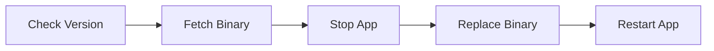

Welcome to this week's **Golang Nugget**, where we dive into practical and powerful concepts every Go developer should know! This week's lineup spans a range of skills and insights:

1. **Mastering Go’s I/O Interfaces** — Learn to optimize data flow and resource management with io.Closer, io.Seeker, WriterTo, and ReaderFrom.
2. **Automating Go Service Updates with Ysco** — A new tool that seamlessly handles app and Go toolchain updates without modifying your app.
3. **Exploring Memory Regions** — A potential game-changer for efficient memory management in Go applications.
4. **Getting Started with Go’s Assembler** — A quick guide to writing assembly code for performance-critical applications.
5. **Token Validation Testing in Go** — Use testcontainer-go and mocks for robust token validation.
6. **Benchmarking with Benchstat** — A look at benchstat's new features for dimension-based benchmark analysis.
7. **Testing with Testcontainers** — Discover best practices for integration testing using real services in Docker containers.
8. **Lingo: Go DSLs** — A lightweight framework for building domain-specific languages with Go.

Ready to sharpen your skills? Dive in for insights, code snippets, and practical examples tailored for Gophers!
<!--more-->



### [Go I/O Closer, Seeker, WriterTo, and ReaderFrom](https://victoriametrics.com/blog/go-io-closer-seeker-readfrom-writeto/index.html)

Go's I/O interfaces extend beyond basic reading and writing, offering powerful tools for resource management and data manipulation:

- `io.Closer`: Handles cleanup of resources. While Go's GC can help with unclosed files, always explicitly close resources to prevent "too many open files" errors.

- `io.Seeker`: Enables cursor movement within data streams using three modes:
```go
reader.Seek(offset, io.SeekStart)  // From beginning
reader.Seek(offset, io.SeekCurrent) // From current position
reader.Seek(offset, io.SeekEnd)    // From end
```

- `io.WriterTo/ReaderFrom`: Optimizes data transfer by allowing direct writing/reading between sources and destinations. On Linux, this can bypass user space entirely for better performance:
```go
// More efficient than manual read/write loops
sourceFile.WriteTo(destinationFile)
destinationFile.ReadFrom(sourceReader)
```

- `io.ByteReader/Writer` and `io.RuneReader/Writer`: Perfect for byte-by-byte or character-by-character operations. RuneReader is especially useful for Unicode handling:
```go
// ReadRune properly handles multi-byte characters
r, size, _ := bufReader.ReadRune() // Returns rune, byte size, error
```

💡 Pro tip: When copying data, `io.Copy()` automatically uses these optimized interfaces when available, falling back to a 32KB buffer otherwise.

[Read more...](https://victoriametrics.com/blog/go-io-closer-seeker-readfrom-writeto/index.html)

---

### [managed automated updates for Go services](https://www.ueber.net/who/mjl/blog/p/ysco-managed-automated-updates-for-go-services/)

Ysco is a new tool that automates updates for Go services without requiring application modifications. The core innovation lies in its ability to manage both application updates and Go toolchain updates through a wrapper approach.

Basic implementation involves wrapping your application execution:
```go
// Instead of
./app [appflags]

// Use ysco
./ysco run [yscoflags] ./app [appflags]
```

The tool works with Go applications that meet two key requirements:
- Built with CGO_ENABLED=0 (no C library dependencies)
- Self-contained with embedded resources using the "embed" package

Update detection happens through two mechanisms:
1. Primary: DNS queries to gopherwatch.org for lightweight version checking
2. Fallback: Go module proxy queries for comprehensive version information

The update process follows this workflow:


Binary updates are sourced from gobuilds.org, which provides reproducible builds verified through a transparency log. The service builds each binary twice on different architectures to ensure consistency.

Update policies are configurable:
- Patch-level updates install automatically by default
- Manual mode available for controlled updates
- Customizable schedule (work hours, evenings, weekends)
- Configurable delays and jitter for rolling updates

The system maintains security through:
- Reproducible builds verification
- Transparency logs for binary verification
- Optional self-hosted build infrastructure
- DNS-based version checking for privacy

This approach solves the common challenge of keeping Go services updated with both application and toolchain updates while maintaining security and reliability through reproducible builds and verification systems.

[Read more...](https://www.ueber.net/who/mjl/blog/p/ysco-managed-automated-updates-for-go-services/)

---

### [memory regions · golang/go · Discussion #70257](https://github.com/golang/go/discussions/70257)

Region-based memory management is proposed as a more composable alternative to Go's arena experiment. The core idea is to allow efficient bulk memory management without requiring API changes or special cases for built-in types.

The design introduces two key functions in a new `region` package:

```go
func Do(f func()) {
    // Creates a new memory region scope
    // Memory allocated inside is automatically managed
}

func Ignore(g func()) {
    // Opts out specific code from the current region
}
```

Here's how you'd use regions compared to arenas:

```go
// Old arena approach
func oldWay(buf []byte) error {
    a := arena.New()
    defer a.Free()
    data := new(MyBigComplexProto)
    if err := proto.UnmarshalOptions{Arena: a}.Unmarshal(buf, data); err != nil {
        return err
    }
    use(data)
}

// New region approach 
func newWay(buf []byte) error {
    var topLevelErr error
    region.Do(func() {
        data := new(MyBigComplexProto)
        if err := proto.Unmarshal(buf, data); err != nil {
            topLevelErr = err
            return
        }
        use(data)
    })
    return topLevelErr
}
```

Key benefits:
- Reduces GC overhead through early memory reclamation
- Works with existing language features and optimizations
- No API changes needed to take advantage of regions
- Memory-safe - incorrect usage won't cause crashes

The implementation uses a goroutine-local write barrier with 1-4% overhead. Memory that escapes the region is automatically moved to the heap. While there's a cost to promoting memory out of regions, the benefits can outweigh this in GC-heavy applications when most allocations stay within the region.

The design includes options for compile-time optimization through PGO and runtime control via GODEBUG flags. This allows for experimentation and performance tuning while maintaining program correctness.

[Read more...](https://github.com/golang/go/discussions/70257)

---

### [A Quick Guide to Go's Assembler - The Go Programming Language](https://go.dev/doc/asm)

Go's assembler is a unique tool that operates on a semi-abstract instruction set, bridging high-level Go code and machine instructions. Here are the key points to understand:

Key Concepts:
- The assembler uses a Plan 9-inspired syntax but with Go-specific features
- Instructions are written in UPPER CASE (e.g., MOVQ, ADDQ)
- Four essential pseudo-registers:
   - FP (Frame Pointer): for arguments and locals
   - SP (Stack Pointer): highest address in local stack frame
   - SB (Static Base): for global symbols
   - PC (Program Counter): for jumps and branches

Important Directives:
```
TEXT    // Defines functions
DATA    // Initializes data
GLOBL   // Declares global symbols
```

Common Symbol Patterns:
```
foo(SB)      // Global symbol
foo<>(SB)    // File-local symbol
first+0(FP)  // Function argument
x-8(SP)      // Local variable
```

Architecture Support:
- Supports multiple architectures (386, amd64, ARM, ARM64, MIPS, PPC64, s390x)
- Each architecture has specific registers and addressing modes
- Compiler generates go_asm.h header for accessing Go types and constants safely

Best Practices:
- Always provide Go prototypes for assembly functions
- Use go_asm.h constants instead of hardcoding struct offsets
- Avoid keeping pointers to stack data in local variables
- Mark data appropriately with NOPTR or RODATA flags for garbage collection

The assembler serves as a crucial tool for performance-critical code and system-level programming in Go, though it should be used judiciously given its complexity.

[Read more...](https://go.dev/doc/asm)

---

### [Token Validation Testing with testcontainer-go and Mocks: A Guide for Go Developers](https://towardsdev.com/token-validation-testing-with-testcontainer-go-and-mocks-a-guide-for-go-developers-9e65e2147679?source=rss------golang-5)

Learn how to build robust token validation testing in Go using testcontainer-go and mocks! Here's a practical approach combining database and external API testing:

Use testcontainer-go to spin up isolated PostgreSQL instances:
```go
req := testcontainers.ContainerRequest{
    Image: "postgres:latest",
    Env: map[string]string{
        "POSTGRES_USER": "testuser",
        "POSTGRES_DB": "testdb",
    },
    ExposedPorts: []string{"5432/tcp"},
}
```

Create vendor client interface for easy mocking:
```go
type VendorClient interface {
    ValidateToken(token string) (bool, error)
}
```

Implement token validation with database caching:
```go
func (tv *TokenValidator) ValidateUserToken(ctx context.Context, userID int, token string) (bool, error) {
    // Check DB cache first
    var validated bool
    err := tv.db.QueryRowContext(ctx, 
        "SELECT validated FROM tokens WHERE user_id = $1 AND token = $2", 
        userID, token).Scan(&validated)
    
    if err == nil {
        return validated, nil
    }
    
    // Call vendor API if not in cache
    validated, err = tv.client.ValidateToken(token)
    if err != nil {
        return false, err
    }
    
    // Cache result
    _, err = tv.db.ExecContext(ctx,
        "INSERT INTO tokens (user_id, token, validated) VALUES ($1, $2, $3)",
        userID, token, validated)
    
    return validated, err
}
```

Key benefits:
- Isolated testing environment with real PostgreSQL
- Mocked external API calls for reliable tests
- Database caching prevents redundant API requests
- Easy to test different validation scenarios

Remember to clean up containers after tests complete using defer cleanup()!

[Read more...](https://towardsdev.com/token-validation-testing-with-testcontainer-go-and-mocks-a-guide-for-go-developers-9e65e2147679?source=rss------golang-5)

---

### [Leveraging Benchstat Projections in Go Benchmark Analysis](https://www.bwplotka.dev/2024/go-microbenchmarks-benchstat/)

Go's benchstat tool received a significant overhaul in 2023, introducing powerful new features for comparing benchmark results. The tool now supports two main approaches for conducting performance comparisons:

Traditional Version-Based Flow:
- Run benchmarks for version A, save results
- Modify code and run benchmarks for version B
- Compare results using `benchstat base=v1.txt new=v2.txt`

New Case-Based Flow:
- Define multiple test cases within a single benchmark
- Run once to capture all variations
- Use benchstat's projection features to analyze different dimensions

The new approach requires following a specific naming convention for sub-benchmarks:
```go
b.Run(fmt.Sprintf("sample=%v", sampleCount), func(b *testing.B) {
    b.Run(fmt.Sprintf("compression=%v", comprType), func(b *testing.B) {
        // benchmark code
    })
})
```

Key benefits of the case-based approach:
- Better reproducibility since all variants run in one session
- Easier sharing and verification of results
- Flexible comparison across any dimension using filters
- More consistent environmental conditions

Example command for analyzing specific dimensions:
```bash
benchstat -row ".name /sample" -filter "/compression:zstd" -col /proto results.txt
```

The case-based approach is particularly useful for complex comparisons across multiple variables like encoding methods, compression algorithms, or data sizes. However, it comes with longer execution times due to running all combinations at once.

Both approaches have their place - use version-based for quick iterations during optimization work, and case-based for thorough, reproducible comparisons across multiple dimensions.

The key takeaway is that benchstat now offers powerful projection and filtering capabilities that make it easier to analyze performance characteristics across multiple dimensions while maintaining reproducibility.

[Read more...](https://www.bwplotka.dev/2024/go-microbenchmarks-benchstat/)

---

### [Comprehensive Guide to Testcontainers for Go: Practical Testing with Containers](https://blog.stackademic.com/comprehensive-guide-to-testcontainers-for-go-practical-testing-with-containers-b11039e0bf41?source=rss------golang-5)

Testcontainers for Go simplifies integration testing by running real services in isolated Docker containers. Here's what you need to know:

Key Benefits:
- Creates isolated test environments with actual databases, message brokers, and other services
- Eliminates environment-related test failures between local and CI systems
- Automatically manages container lifecycle (creation and cleanup)

Quick Setup Example:
```go
container, err := testcontainers.GenericContainer(ctx, testcontainers.GenericContainerRequest{
    ContainerRequest: testcontainers.ContainerRequest{
        Image:        "postgres:latest",
        ExposedPorts: []string{"5432/tcp"},
        Env: map[string]string{
            "POSTGRES_PASSWORD": "password",
            "POSTGRES_DB":       "testdb",
        },
        WaitingFor: wait.ForListeningPort("5432/tcp"),
    },
    Started: true,
})
```

Performance Tips:
- Reuse containers across tests using TestMain() when possible
- Use lightweight container images (alpine variants)
- Implement specific readiness checks instead of generic waits
- Configure appropriate resource limits in Docker settings

Supports multiple services including:
- Databases (PostgreSQL, MongoDB)
- Message brokers (Kafka)
- Custom API mocks
- Multiple container orchestration

Want reliable integration tests? Start using Testcontainers instead of mocks for accurate service behavior testing in isolated environments.

[Read more...](https://blog.stackademic.com/comprehensive-guide-to-testcontainers-for-go-practical-testing-with-containers-b11039e0bf41?source=rss------golang-5)

---

### [Lingo: A Go micro language framework for building Domain Specific Languages](https://about.gitlab.com/blog/2022/05/26/a-go-micro-language-framework-for-building-dsls/)

Domain Specific Languages (DSLs) offer a focused way to solve domain-specific problems more efficiently than general-purpose languages. Let's explore this through a practical example of summing bank account balances from a CSV file.

Consider two approaches to sum balances from this CSV structure:
```csv
name, balance
Lisa, 100.30
Bert, 241.41
Maria, 151.13
```

A general-purpose language (Ruby) solution requires 208 characters:
```ruby
#!/usr/bin/env ruby
exit(1) if ARGV.empty? || !File.exist?(ARGV[0])
sum = 0
File.foreach(ARGV[0]).each_with_index do |line, idx|
  next if idx == 0
  sum += Float(line.split(',')[1])
end
puts sum.round(2)
```

While a DSL (AWK) solution needs just 56 characters:
```awk
#!/usr/bin/awk -f
BEGIN{FS=","}{sum+=$2}END{print sum}
```

To address these challenges, Lingo was developed as a micro language framework in Go. It uses S-expressions for representing both code and data. For example, the expression `1 + 2 * 3 + 5` becomes `(+ 1 (* 2 3) 5)` in S-expression format.

Key features of Lingo include:
- Pure Go implementation (~3K lines)
- Extensible plugin system for new functions and types
- Simple parser/processor architecture
- No need to modify core components when extending

A practical implementation example shows building a Random Text Generator (RTG) with these core functions:
- `(oneof s0, s1, ..., sN)`: Random string selection
- `(join e0, e1, ..., eN)`: String concatenation
- `(genfloat min max)`: Random float generation
- `(times num exp)`: Pattern repetition

The framework demonstrates how DSLs can simplify complex tasks while maintaining flexibility and extensibility, all with minimal implementation overhead.

[Read more...](https://about.gitlab.com/blog/2022/05/26/a-go-micro-language-framework-for-building-dsls/)