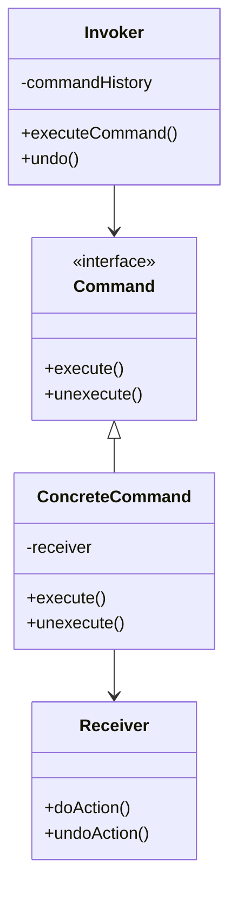
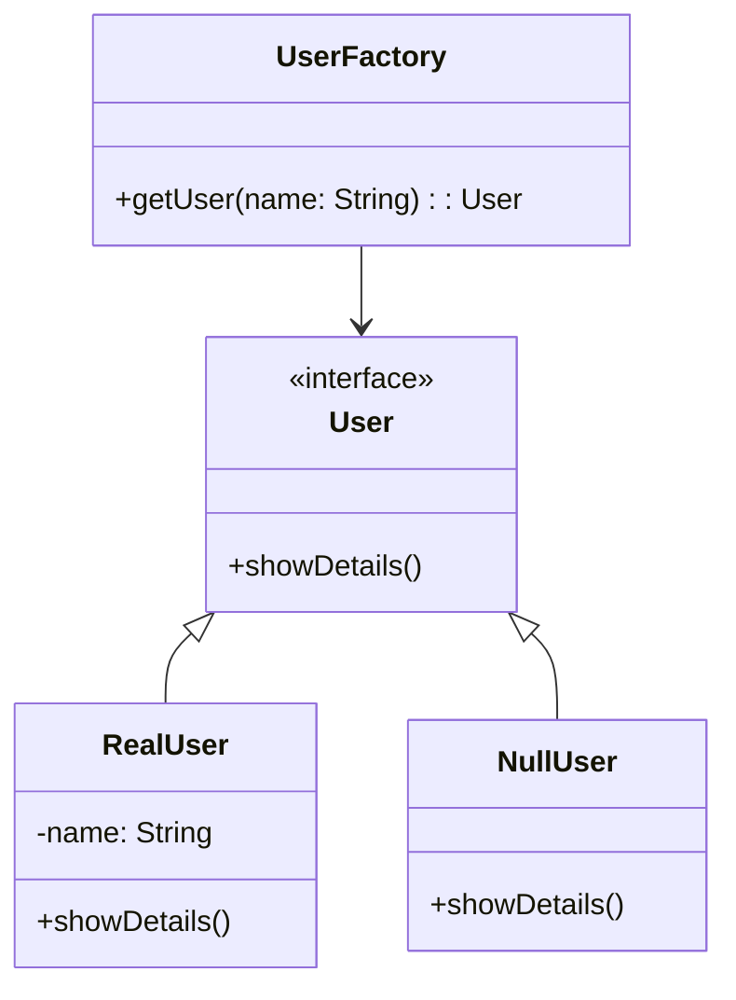

Welcome to this week’s **Architecture Nugget**, where I’ve rounded up some of the most insightful and thought-provoking reads from the software architecture community.
In this edition:

- **Encryption Demystified**: Why building your own application-layer encryption is a rabbit hole and how established solutions can save you time and risk.
- **Balancing Act**: Use Pareto efficiency to make smarter trade-offs between performance, security, and scalability.
- **Cloud Layers Explained**: A walkthrough of multi-tier cloud architectures and their real-world applications.
- **Synchronous vs. Asynchronous**: The art of choosing the right communication model for distributed systems.
- **Scaling Smarts**: Lessons from scaling a URL shortener service with progressive optimization.
- **Design Patterns in Action**: Deep dives into Undoable Command and Null Object patterns to simplify and future-proof your code.

Each topic is handpicked to deliver actionable insights you can apply to your projects. Let’s dig in and level up your architecture game!

<!--more-->



### [Build Your Own Application-Layer Encryption? - The Salty Hash](https://blog.ironcorelabs.com/build-your-own-application-layer-encryption-62b12bfd0e4b?source=rss------software_architecture-5)

Building application-layer encryption (ALE) seems deceptively simple but hides numerous complex challenges that can seriously impact security and scalability. Here's what you really need to know:

Key Management is Trickier Than You Think:
- Never fetch keys from KMS - use it for encryption/decryption operations only
- Implement envelope encryption with unique keys per data piece
- Plan for algorithm evolution and key rotation scenarios
- Consider key metadata tracking and headers on ciphertext

Storage Integration Pitfalls:
- MySQL's built-in encryption is problematic (uses weak AES-ECB-128 by default)
- S3 SSE-C requires careful handling for pre-signed URLs and file operations
- Storing KMS connection info in databases creates security vulnerabilities

Hidden Complexities:
- Performance hits from numerous KMS calls
- Data sovereignty requirements across different regions
- Secure memory management for encryption keys
- Cross-cloud KMS compatibility
- Network latency and resilience considerations

Building your own ALE system will likely cost millions in development and maintenance while potentially introducing security vulnerabilities. The complexity grows exponentially when handling customer-held keys, data sovereignty, and performance at scale.

Instead of DIY, consider using established solutions that have already solved these challenges. They'll help you avoid common pitfalls and provide better security assurance for your customers.

Remember: Just because you can encrypt data with a simple encrypt() call doesn't mean you've built a secure, scalable crypto-system. The devil's in the details, and those details are numerous and complex.

[Read more...](https://blog.ironcorelabs.com/build-your-own-application-layer-encryption-62b12bfd0e4b?source=rss------software_architecture-5)

---

### [Applying Pareto Efficiency to Attribute-Driven Design (ADD) in Software Architecture](https://medium.com/@JacekWo/applying-pareto-efficiency-to-attribute-driven-design-add-in-software-architecture-40436f214989?source=rss------software_architecture-5)

Let's talk about using Pareto efficiency to make better software architecture decisions, particularly when dealing with competing quality requirements. You know how it's always a balancing act between different system qualities? Well, that's exactly what this approach helps with.

The core idea is pretty straightforward - you can't improve one quality attribute without affecting another. It's like trying to optimise both performance and security - better security often means slower performance, and vice versa.

Here's how it works in practice:

1. First, identify your key quality attributes (like performance, security, reliability)
2. Create specific scenarios for each attribute
3. Map out how different architectural choices affect each attribute
4. Find solutions that represent the best possible trade-offs

Let's look at a real-world example of designing a ride-sharing app. We've got three main architectural approaches:

```yaml
Performance-Focused (Alternative 1):
  - Aggressive caching
  - In-memory data stores
  - Monolithic architecture
  Results: High performance but poor reliability and scalability

Balanced (Alternative 2):
  - Microservices architecture
  - Load balancing
  - Standard caching
  - OAuth 2.0 security
  Results: Good balance across all attributes

Reliability-Focused (Alternative 3):
  - Redundant services
  - Synchronous communication
  - Heavy monitoring
  Results: Excellent reliability but poor performance
```

Through iteration and stakeholder feedback, we actually ended up with a refined version of Alternative 2 that uses gRPC for services and asynchronous processing. This gave us better performance without sacrificing other qualities.

The brilliant thing about this approach is that it helps you make informed decisions rather than just going with your gut. You can actually see how each choice affects different aspects of your system, and you're not wasting time on solutions that are clearly suboptimal.

Remember though, it's not about finding a perfect solution - it's about finding the best possible balance for your specific needs. Sometimes you'll need to prioritise performance, other times security might be paramount. The key is understanding these trade-offs and making conscious decisions about them.

[Read more...](https://medium.com/@JacekWo/applying-pareto-efficiency-to-attribute-driven-design-add-in-software-architecture-40436f214989?source=rss------software_architecture-5)

---

### [Multi-Tier Cloud Architectures Explained - Dave Patten - Medium](https://medium.com/@dave-patten/multi-tier-cloud-architectures-explained-7973325644f1?source=rss------cloud_architecture-5)

Multi-tier architectures separate your app into distinct layers - typically presentation (frontend), logic (backend), and data. This separation isn't just for show - it lets you scale and manage each part independently.

The main architectural patterns you'll encounter are:

- **Three-Tier**: The classic approach using VMs for compute, perfect for straightforward web apps
- **Microservices**: Breaking things into small, independent services - brilliant for large, complex systems
- **Serverless**: Event-driven functions that scale automatically - great for variable workloads
- **Edge Computing**: Processing near the user for super-fast response times
- **Hybrid**: Mixing on-premises and cloud - handy for regulatory requirements

Key best practices to keep in mind:

- Plan for horizontal scaling (adding more instances) rather than vertical (bigger machines)
- Encrypt everything, both in transit and at rest
- Use multi-region deployments for resilience
- Implement proper monitoring and alerting
- Automate deployments with CI/CD pipelines
- Cache strategically at multiple levels
- Use CDNs for better performance

Whether you're building a simple web app or a complex distributed system, choosing the right architecture and following these practices will set you up for success. The trick is matching the architecture to your specific needs - there's no one-size-fits-all solution.

Want to dive deeper? Consider exploring how these patterns handle different failure scenarios, or how they might evolve as your application grows.

[Read more...](https://medium.com/@dave-patten/multi-tier-cloud-architectures-explained-7973325644f1?source=rss------cloud_architecture-5)

---

### [The Language of Machines: How Different Systems Communicate in Distributed Environments](https://medium.com/@hyderabad.pm/the-language-of-machines-how-different-systems-communicate-in-distributed-environments-9b3c4944537f?source=rss------distributed_systems-5)

Modern distributed systems thrive on a clever mix of synchronous and asynchronous communication - think of it like having both instant messaging and email in your toolkit.

Synchronous communication is your go-to when you need immediate responses:
- Systems wait for each other (like a phone call)
- Perfect for real-time operations like payment processing
- Creates tighter coupling between systems
- Typically uses HTTP/REST APIs

Asynchronous communication lets systems work independently:
- Fire-and-forget messaging (like sending a text)
- Brilliant for background tasks and notifications
- Keeps systems loosely coupled
- Often uses message brokers like Kafka or RabbitMQ

Here's a practical example from e-commerce:
- Customer places order → Synchronous confirmation (immediate feedback)
- Order processing → Asynchronous tasks (inventory checks, payment processing, shipping updates)
- Status updates → Asynchronous notifications (email confirmations, tracking updates)

The hybrid approach shines in real-world applications:
- Banking: Synchronous for transfers, asynchronous for notifications
- E-commerce: Synchronous for order placement, asynchronous for fulfilment
- Social media: Synchronous for likes, asynchronous for content distribution

Pro tip: Choose synchronous when immediate feedback is crucial, and asynchronous when you need scalability and resilience. Most robust systems cleverly combine both approaches.

Fancy exploring this further? Consider how your current project might benefit from mixing these communication styles. Could switching some synchronous operations to asynchronous improve your system's scalability?

[Read more...](https://medium.com/@hyderabad.pm/the-language-of-machines-how-different-systems-communicate-in-distributed-environments-9b3c4944537f?source=rss------distributed_systems-5)

### [Yet Another URL Shortener Service… But starting simple](https://medium.com/@knands42/yet-another-url-shortener-service-but-starting-simple-cc741b097ac7?source=rss------scalability-5)

Let's dive into scaling a URL shortener service through progressive optimization steps. The core challenge here is maintaining high performance while tracking URL access metrics.

Starting with a basic PostgreSQL schema for storing shortened URLs and access counts, we implement several optimization layers:

1. Query Optimization
   First up, we combine SELECT and UPDATE operations into a single query using PostgreSQL's RETURNING clause - this cuts database roundtrips in half.

2. Caching Strategy
   We implement Redis caching with TTL policies to reduce database load. The system uses a write-through cache pattern where data is populated during writes rather than reads. This ensures cache consistency but requires careful invalidation handling.

3. Asynchronous Processing
   To handle metadata updates efficiently, we implement the Outbox Pattern:
```yaml
Components:
- URL access events stored in outbox table
- Batch processor running on intervals
- SKIP LOCKED mechanism for concurrent processing
```

4. Resilience Patterns
   The system implements circuit breakers with fallbacks:
- Closed: Normal Redis operation
- Open: Fallback to PostgreSQL
- Half-Open: Limited Redis requests during recovery

5. Database Scaling
   Once the above optimizations are in place, we implement database scaling through:
- Connection pooling with PGBouncer
- Read replicas (10:1 read/write ratio)
- Hash-based sharding across database instances
- Table partitioning for large datasets

Performance Metrics:
- Handles 5,000 new URLs/second
- 50,000 reads/second
- 432M new URLs monthly
- 5-character base64 hash supporting >1B unique URLs

The architecture progressively scales from simple optimizations to complex distributed patterns, only adding complexity when needed. Each layer builds upon the previous one, creating a robust system that can handle high throughput while maintaining data consistency and system reliability.

This approach demonstrates how to scale gradually by optimizing existing components before adding new infrastructure, resulting in a system that's both performant and maintainable.

[Read more...](https://medium.com/@knands42/yet-another-url-shortener-service-but-starting-simple-cc741b097ac7?source=rss------scalability-5)

---

### [Complete Guide to External State Stores: Implementation and Best Practices](https://scaibu.medium.com/complete-guide-to-external-state-stores-implementation-and-best-practices-6872b23d6266?source=rss------microservice-5)

Modern distributed systems need robust ways to manage state across different services. External state stores are basically persistent storage systems that live outside your service but within the same network, acting as the source of truth for your application's state.

There are three main types of state you'll deal with:
- Ephemeral: Temporary data that vanishes when the app restarts (like shopping cart contents)
- Persistent: Long-term data that sticks around (think user profiles)
- Cached: Quick-access temporary data with an expiry time (like weather forecasts)

For implementation, you've got two popular choices:

Redis works brilliantly for:
- Fast, in-memory operations
- Temporary data with TTL
- Atomic updates to prevent race conditions
- Real-time features

PostgreSQL shines when you need:
- Strong consistency
- Complex transactions
- Durable storage
- Structured data relationships

The article emphasises some crucial patterns:

Event Sourcing:
```yaml
pattern: "Event Sourcing"
purpose: "Track state changes as immutable events"
benefits:
  - Complete audit trail
  - Time travel debugging
  - Easy state reconstruction
```

CQRS (Command Query Responsibility Segregation):
```yaml
pattern: "CQRS"
implementation:
  commands: "Handle state changes"
  queries: "Handle state reads"
benefits:
  - Optimised read/write operations
  - Better scalability
```

Key implementation principles:
- Always implement proper error handling with retries
- Use circuit breakers for external dependencies
- Monitor system health religiously
- Cache strategically
- Encrypt sensitive data
- Plan for scaling from day one

The most critical don'ts:
- Never share state stores between microservices
- Don't put complex business logic in state stores
- Never skip error handling
- Don't store sensitive data without encryption
- Don't ignore performance monitoring

This architecture provides a solid foundation for building reliable, scalable distributed systems while maintaining data consistency and performance.

[Read more...](https://scaibu.medium.com/complete-guide-to-external-state-stores-implementation-and-best-practices-6872b23d6266?source=rss------microservice-5)

---

### [Undoable Command Design pattern](https://anubhav-gupta62.medium.com/undoable-command-design-pattern-30ca60b445cd?source=rss------design_patterns-5)

You know how frustrating it is when you can't undo a mistake in an application? Well, that's exactly what the Undoable Command pattern solves. It's basically an extension of the regular Command pattern, but with a clever twist that lets operations be reversed.

Here's how it works:
<div style="max-width:300px">

</div>
The architecture revolves around four main components working together:

1. A Command interface that defines both execute() and unexecute() methods
2. Concrete Commands that implement these methods and maintain their own state
3. An Invoker that manages command execution and keeps track of history
4. A Receiver that actually performs the work

The clever bit is the history stack - it's like a breadcrumb trail of everything that's happened. When you execute a command, it gets pushed onto this stack. Want to undo something? Just pop the last command off the stack and call its unexecute() method. Simple!

```yaml
Implementation Pattern:
  Components:
    - Command Interface
    - Concrete Commands
    - Invoker with History Stack
    - Receiver
  Key Operations:
    - Execute: Performs action and stores in history
    - Unexecute: Reverses previous action
```

The beauty of this pattern is how it separates concerns. Each command is self-contained, knowing both how to do something and how to undo it. This makes it brilliant for things like text editors, drawing apps, or anywhere you need to implement undo/redo functionality.

The main advantages? Well, it's incredibly flexible - you can add new commands without touching existing code, and it makes implementing undo/redo functionality almost trivial. Plus, it keeps your code organised and maintainable, since each command is responsible for its own behaviour.

[Read more...](https://anubhav-gupta62.medium.com/undoable-command-design-pattern-30ca60b445cd?source=rss------design_patterns-5)

---

### [Null Object Design Pattern](https://anubhav-gupta62.medium.com/null-object-design-pattern-f16e426ec15f?source=rss------design_patterns-5)

You know how null checks can really make code messy and error-prone? Well, that's exactly what the Null Object pattern helps us tackle. It's quite clever, actually - instead of using null references, we create a special object that implements the same interface but does nothing (or provides default behaviour).

Let's break down how it works:



The pattern's structure is pretty straightforward:
- An interface defines the expected behaviour
- A concrete class implements the actual functionality
- A null object class implements the same interface but with neutral behaviour
- A factory creates either real or null objects based on conditions

Here's a practical example of how it's implemented:

```yaml
Components:
  Interface: User
  Concrete Class: RealUser
  Null Object: NullUser
  Factory: UserFactory
```

The beauty of this pattern lies in its simplicity. Rather than littering your code with null checks, you can just work with objects that always behave predictably. It's particularly brilliant for scenarios like handling premium vs standard users, where some functionality might not be available.

The main benefits? Well, your code becomes cleaner and more maintainable. You're less likely to run into those pesky NullPointerExceptions, and your client code doesn't need to know whether it's dealing with a real object or a null object. It's quite elegant, really.

Best used when:
- You've got optional components or features
- You want to avoid null reference checks
- You need a default behaviour for missing objects
- You're working with chain-of-responsibility patterns

It's worth noting that while this pattern might seem like a bit of overhead initially, it really pays off in terms of code clarity and reduced error handling.

[Read more...](https://anubhav-gupta62.medium.com/null-object-design-pattern-f16e426ec15f?source=rss------design_patterns-5)